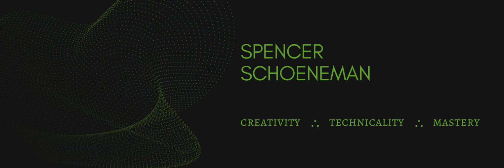

</img>

<!-- <h1 align="center"> Hi, I'm Spencer </h1> -->

<!-- <h3 align="center" style="border: 0">Self-Taught Developer, Musician, & Disc Golf Enthusiast</h3> -->

<!--   -->

<h3 align="center">Software development has taken my lifelong compulsion for creativity and perfectly married it to   my passion for deep comprehension, mastery of craft, and problem solving.</h3>

---

<h2 align="center" style="border: 0">Portfolio</h2>

<table align="center">
  <tr>
    <td align="center">
      <h3>Calculator</h3>
      
      

        <a href="https://github.com/Spencer-Sch/Calculator_2.0">Github Repo</a>
      

    </td>
    <td align="center">
      <h3>Budget Parse and Add</h3>
      
      

        <a href="https://github.com/Spencer-Sch/budget-parse-and-add-app">Github Repo</a>
      

    </td>
  </tr>
</table>

---

<h2 align="center" style="border: 0">About Me</h2>

<h3>Hi, I'm Spencer: Self-Taught Developer, Musician, & Disc Golf Enthusiast.</h3>

Coding has surfaced as an interest many times throughout my life. My choice of careers after high-school was between programming and music. I chose music, did well in school, and was successful in the field over the next six years. I was forced to make some difficult decisions when COVID struck and the music industry disappeared for two years. My alternative career path was simple: coding.

Being highly motivated and a strong self-starter, the self-taught route was the natural choice for my web-development education.

I am looking to work on a team with passionate, highly skilled colleagues along side whom I can deepen my understanding and increase my mastery of all things development related.

<h3>From Rhythmic Engineer to Front-End Engineer</h3>

As a musician, and drummer specifically, I have always identified more with the technical and structural aspects of the art-form as apposed to the aspects of self-expression and artistry.

This focus on the structure, architecture, and purpose of the music has perfectly positioned me for a transition into a highly technical field and enables me to bring along a large set of skills that seamlessly apply to both music performance and software development.

<h3>Soft Skills</h3>
<ul>
  <li>The ability to both collaborate with others and self-direct when working solo</li>
  <li>Ceaseless learning and practice</li>
  <li>Balancing between creativity and technicality</li>
  <li>Learning the rules of a language and learning when and how to bend them</li>
  <li>Strong communication</li>
  <li>The breaking down of large projects into small tasks</li>
  <li>Dedication to a craft</li>
</ul>

🔨 **Current Project:** [Found Wisdom App](https://github.com/Spencer-Sch/found-wisdom-app)  
🌱 **Learning Queue:** Jest.js, Node.js, Next.js, MySQL   
⚡ **Fun fact:** I am a professional [drum set performer](https://www.youtube.com/watch?v=xQjwAfeLmGw), [educator](https://inthekeyofrhythm.com/lessons/), and [author](https://inthekeyofrhythm.com/product/making-a-drummer/)  

### Connect with me:

[][linkedin]

 

### Languages and Tools:

 
 

---

### 🎓 Relevant Coursework:

- [JavaScript - The Complete Guide](https://www.udemy.com/course/javascript-the-complete-guide-2020-beginner-advanced/) by Maximilian Schwarzmuller
- [React - The Complete Guide](https://www.udemy.com/course/react-the-complete-guide-incl-redux/) by Maximilian Schwarzmuller
- [Understanding TypeScript](https://www.udemy.com/course/understanding-typescript/) by Maximilian Schwarzmuller
- [CSS - The Complete Guide](https://www.udemy.com/course/css-the-complete-guide-incl-flexbox-grid-sass/) by Maximilian Schwarzmuller
- [JavaScript Algorithms and Data Structures Masterclass](https://www.udemy.com/course/js-algorithms-and-data-structures-masterclass/) by Colt Steele
- [The Git & Github Bootcamp](https://www.udemy.com/course/git-and-github-bootcamp/) by Colt Steele
- [The 50 Most Popular Linux & Terminal Commands](https://www.youtube.com/watch?v=ZtqBQ68cfJc) by Colt Steele
- [Clean Code](https://www.udemy.com/course/writing-clean-code/) by Maximilian Schwarzmuller

[linkedin]: https://www.linkedin.com/in/spencer-schoeneman-b621908b/
