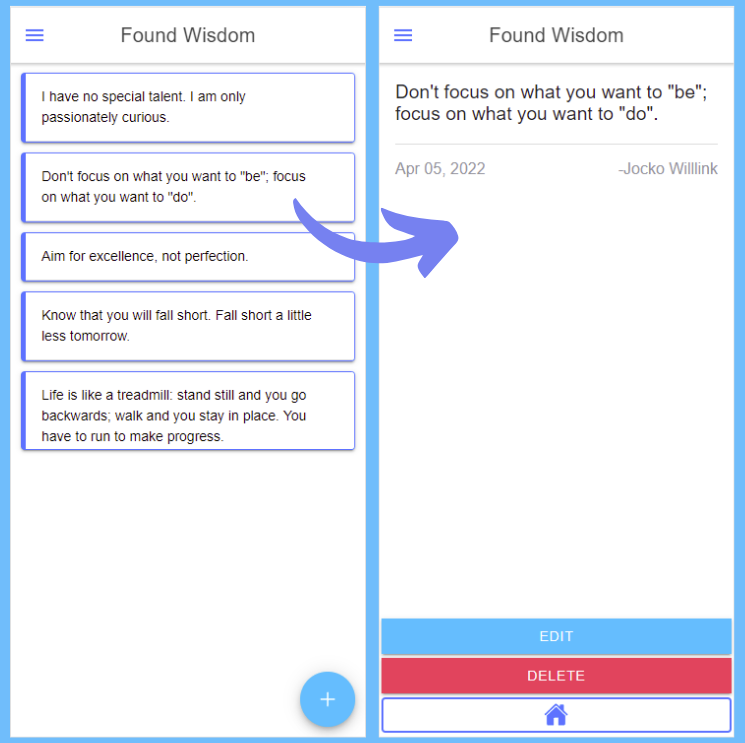
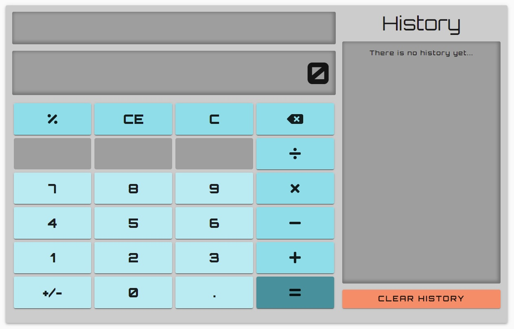
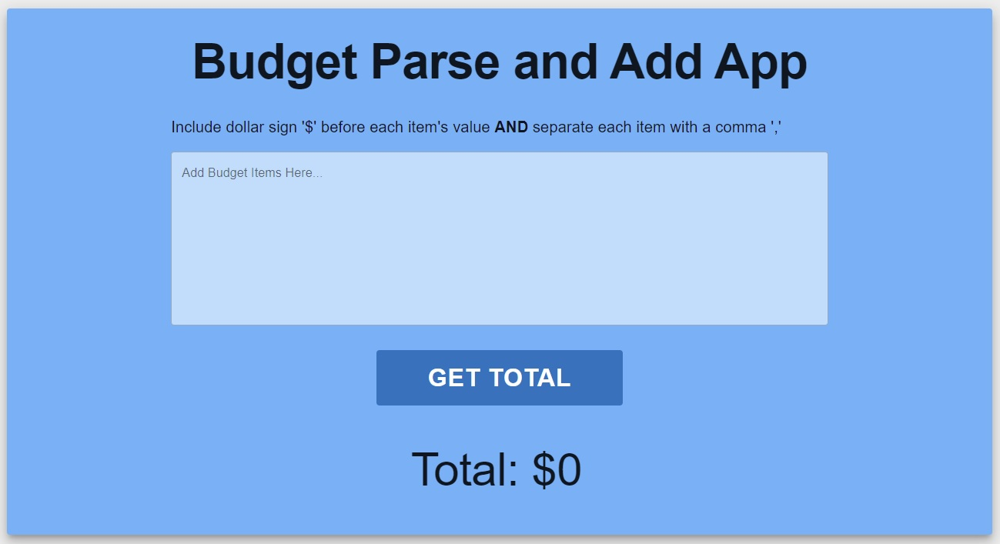

</img>

<h1 align="center"> Hi, I'm Spencer </h1>

<h3 align="center">I'm driven to excel at the intersection of creativity and technicality</h3>

 

- 💻 Front-end Engineer at [Candide](https://www.linkedin.com/company/candidenft/about/)

- 🚀 Currently building an NFT rental marketplace

- 🥁 Professional drummer, educator, and author

- ☕ Love brewing coffee

 

### Let's chat!

[][discord]
[][linkedin]
[][gmail]

 
 

### Languages and Tools

 
 
 

 
 
 

<h2 align="center">Portfolio</h2>

<table align="center">
  <tr align="center">
  <td align="center">
      <h4>Candide | Landing Page</h4>
      
      

        <a href="https://fanciful-hummingbird-900183.netlify.app">Live Demo</a> | <a href="https://github.com/Spencer-Sch/candide-landing-page">Github Repo</a>
      

    </td>
    <td align="center">
      <h4>Found Wisdom App</h4>
      
      

        <a href="https://github.com/Spencer-Sch/found-wisdom-app">Github Repo</a>
      

    </td>
  </tr>
</table>

<table align="center">
  <tr>
    <td align="center">
      <h4>Calculator 2.0</h4>
      
      

        <a href="https://calc-app-2.herokuapp.com/">Live Demo</a> | <a href="https://github.com/Spencer-Sch/Calculator_2.0">Github Repo</a>
      

    </td>
    <td align="center">
      <h4>Budget Parse and Add</h4>
      
      

        <a href="https://budget-sum-app.herokuapp.com/">Live Demo</a> | <a href="https://github.com/Spencer-Sch/budget-parse-and-add-app">Github Repo</a>
      

    </td>
  </tr>
</table>

[linkedin]: https://www.linkedin.com/in/spencer-schoeneman-b621908b/
[gmail]: mailto:spencer.schoeneman@gmail.com
[discord]: https://discord.com/users/991368006435344444
