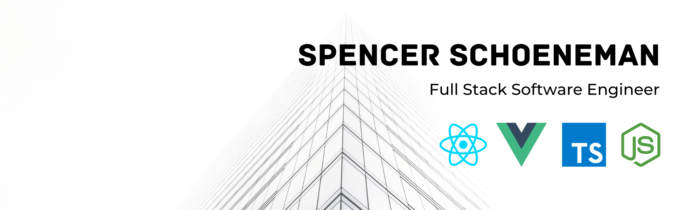
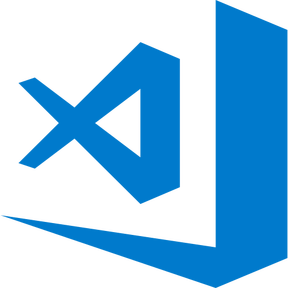

</img>

<h1 align="center"> Hi, I'm Spencer </h1>

<h3 align="center">I'm driven to excel at the intersection of creativity and technicality</h3>

 

- #### 💻 Developer at [Nebulai](https://nebulai.com/) 🚀 building an AI-assisted talent platform

- #### 💻 Developer at [Candide](https://candide.site/) 🚀 building an NFT rental marketplace

- #### 🥁 Professional [drummer, educator, and author](https://inthekeyofrhythm.com/)

- #### ☕ Love brewing coffee 🥏 and playing disc golf

 

### Let's chat!

[][gmail]
[][linkedin]
[][discord]

 
 

### Languages and Tools

 
 
 

 
 
 

<h2 align="center">Portfolio</h2>

<table align="center">
  <tr align="center">
  <td align="center">
      <h4>Nebulai</h4>
      
      

        <a href="https://nebulai.com/">Website</a> | <a href="https://github.com/nebulaidigital">Github</a>
      

    </td>
  <td align="center">
      <h4>Candide | Marketplace</h4>
      <!-- 
⚠️In Active Development⚠️
 -->
      
      

        <a href="https://marketplace.candide.site/">Marketplace</a> | <a href="https://github.com/Spencer-Sch/candide-marketplace-info">Project Info</a>
      

    </td>
  </tr>
</table>

<table align="center">
  <tr align="center">
  <td align="center">
      <h4>Candide | Landing Page</h4>
      
      

        <a href="https://candide.site/">Website</a> | <a href="https://github.com/Spencer-Sch/candide-production-landing-page">Project Info</a>
      

    </td>
  <td align="center">
      <h4>Encode Battles | NFT Game</h4>
      
      

        <a href="https://github.com/Spencer-Sch/Encode_Solidity_Bootcamp_Group_5_Final_Project">Github Repo</a>
      

    </td>
  </tr>
</table>

<table align="center">
  <tr>
  <td align="center">
      <h4>Honey Badger HR | CCIP Payroll</h4>
      
      

        <a href="https://github.com/Spencer-Sch/CCIP-Payroll">Github Repo</a>
      

    </td>
    <td align="center">
      <h4>Calculator 2.0</h4>
      
      

        <a href="https://fantastic-salamander-71def7.netlify.app">Live Demo</a> | <a href="https://github.com/Spencer-Sch/Calculator_2.0">Github Repo</a>
      

    </td>
  </tr>
</table>

<!-- <table align="center"> -->
<!--   <tr> -->
<!--     <td align="center"> -->
<!--       <h4>Budget Parse and Add</h4> -->
<!--       <a href="https://cosmic-kitten-bb9550.netlify.app" target="_blank"> -->
<!--          -->
<!--       </a> -->
<!--       
 -->
<!--         <a href="https://cosmic-kitten-bb9550.netlify.app">Live Demo</a> | <a href="https://github.com/Spencer-Sch/budget-parse-and-add-app">Github Repo</a> -->
<!--       
 -->
<!--     </td> -->
<!--   </tr> -->
<!-- </table> -->

[linkedin]: https://www.linkedin.com/in/spencer-schoeneman-b621908b/
[gmail]: mailto:spencer.schoeneman@gmail.com
[discord]: https://discord.com/users/991368006435344444
